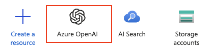
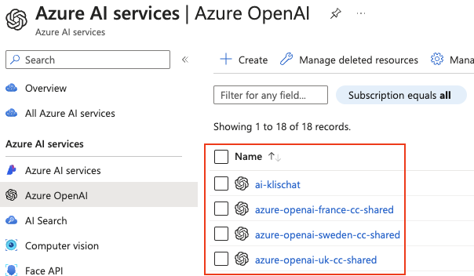
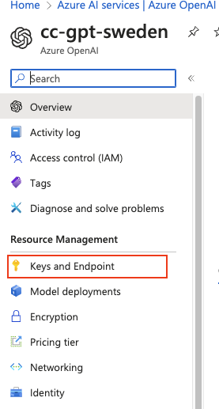
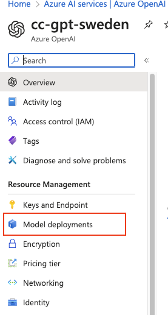
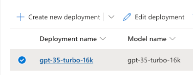
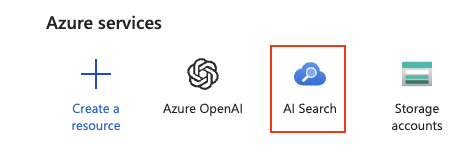
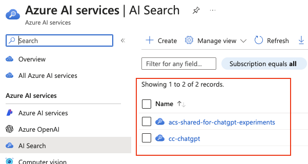
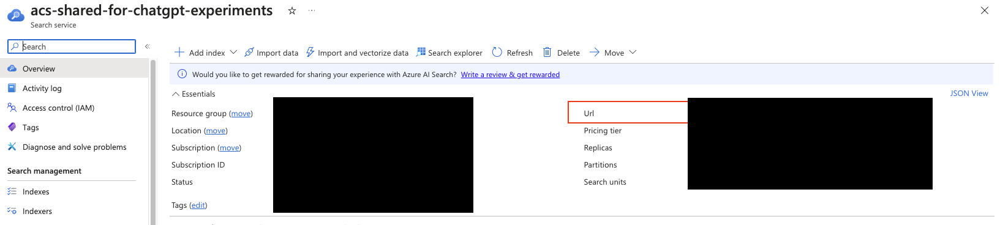
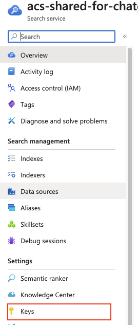

# Rag Prototype

## Introduction
Dieses Repository beinhaltet eine prototypische Anwendung mit der die praktische Anwendung einer RAG Pipline
verdeutlicht werden soll. Geschrieben ist die Anwendung mit Python und benutzt die Azure AI Search als Vector Store
sowie ein in Azure gehostetes GPT.

## Voraussetzungen
Zum lokalen Ausführen der Anwendung wird __python 3.10.13__ vorausgesetzt. Es ist ebenfalls möglich die Anwendung mit
Docker zu hosten in diesem Fall wird eine Docker Runtime entweder Lokal oder auf einem Server benötigt.

### Konfiguration
Da die Anwendung Features aus der Azure Cloud benutzt ist es notwendig Informationen wie z.B. Endpoints oder API Keys
zu hinterlegen.  
Das wird mit Environment Variablen gemacht. wenn die Anwendung Lokal oder auf einem Development Rechner als Docker
Container ausgeführt wird, werden die Environment Variablen über ein .env File konfiguriert.
Ein Template dieses Files ist in der Project Root unter dem namen [template.env](./template.env) zu finden.  
Diesem File können auch alle benötigten Environment Variablen entnommen werden.

#### Wo kann ich welche Env Var finden?
1. `AZURE_OPENAI_ENDPOINT` & `AZURE_OPENAI_API_KEY`
   1. Zuerst muss der Service OpenAI geöffnet werden.
      1. 
   2. Dann as gewünschte deployment aus der Liste auswählen
      1. 
   3. Der letzte Schritt ist in der Liste auf der Linken Seite `Keys & Endpoint auszuwählen`
      1. 
2. `AZURE_OPENAI_API_EMBEDDING_DEPLOYMENT_NAME`
   1. Bis zu 1.ii sind alle Schritte gleich. Im letzten Schritt muss man nun `Model deployments auswählen`
      1. 
      2. 
3. `AZURE_AI_SEARCH_SERVICE_ENDPOINT` & `AZURE_AI_SEARCH_SERVICE_API_KEY`
   1. Zuerst muss der Service AzureAI Search geöffnet werden.
      1. 
   2. Dann muss das Deployment ausgewählt werden
      1. 
   3. Den `AZURE_AI_SEARCH_SERVICE_ENDPOINT` kann man nun unter `URL` ind Overview finden
      1. 
   4. Für `AZURE_AI_SEARCH_SERVICE_API_KEY` muss man aus der List auf der Linken seite `Keys` auswählen
      1. 

### lokales ausführen
Unter der Annahme, dass Python bereits installiert ist, wird nun ein Paketmanager benötigt um Dependencies zu installieren.
In diesem Projekt wird dafür Pipenv benutzt. Installiert werden kann Pipenv mit dem folgenden Befehl `pip install pipenv`  

Im nächsten Schritt muss die Virtuelle umgebung mit dem folgenden Befehl erstellt werden `pipenv shell`.  
Danach werden die Dependencies mit `pipenv install` installiert.  
Gestartet wird die Anwendung mit `streamlit run chat_with_Rag.py`

### Ausführen auf einer Development Rechner mit Docker Compose
Eine weitere Alternative die Anwendung auszuführen ist als Docker Container über Docker Compose.
Dafür muss auf dem Rechner eine Docker Runtime, die Docker CLI sowie Docker Compose installiert sein.

In diesem Fall reicht es den Befehl `docker-compose up --build` im Project root auszuführen.  
Wenn man den Container unabhängig von der Terminal-Sitzung weiter laufen lassen möchte, kann man das mit diesem Befehl
erreichen `docker-compose up -d --build`

Der Zusatz `--build` wird alle im `compose.yaml` File aufgeführten Services neu bauen das ist dann __notewendig__ wenn
änderung am code gemacht wurden oder der Container zum ersten Mal gestartet werden soll.  
Im normalfall reicht es `docker-compose up` oder `docker-compose up -d` auszuführen.

Wenn der build und das Deployment in die Docker Runtime Erfolgreich war sollte die Anwendung nun unter
der URL http://0.0.0.0:8501 verfügbar.